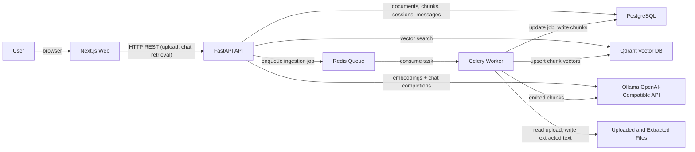

# Architecture

The system is a Dockerized RAG application with separate web, API, worker, database, queue, vector store, and local model services.

## Services

- `web`: Next.js UI for dashboard, upload, documents, chat, and retrieval debug.
- `api`: FastAPI service with upload, retrieval, chat, health, and persistence APIs.
- `worker`: Celery worker that extracts, chunks, embeds, and stores vectors asynchronously.
- `postgres`: relational source of truth for documents, chunks, ingestion jobs, and chat history.
- `redis`: queue broker and Celery result backend.
- `qdrant`: vector database for chunk embeddings.
- `ollama`: local OpenAI-compatible embeddings and chat provider.

## Data Model

Core tables:

- `documents`: upload metadata, storage path, status, errors, extraction metadata.
- `ingestion_jobs`: async job state, attempts, timestamps, logs, errors.
- `chunks`: chunk text, token counts, page metadata, embedding metadata, Qdrant point ID.
- `chat_sessions`: conversation metadata and status.
- `chat_messages`: persisted user and assistant messages, citations, retrieved context, metadata.

## Runtime Boundaries

The API owns synchronous user-facing workflows. The worker owns expensive ingestion work. Qdrant is treated as a search index, while Postgres remains the durable metadata and conversation store.
