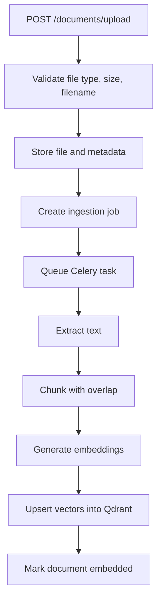

# Ingestion Pipeline

Document ingestion is asynchronous and handled by the Celery worker.

## Statuses

Documents move through:

- `uploaded`
- `queued`
- `processing`
- `embedded`
- `failed`

Ingestion jobs track:

- `queued`
- `running`
- `retrying`
- `succeeded`
- `failed`

## Failure Handling

- Empty documents fail cleanly without retry.
- Corrupted PDFs and transient provider failures are retried by Celery.
- Worker logs are persisted in `ingestion_jobs.logs`.
- Document and job error fields are updated before completion.

## Chunking

Default chunking uses an approximate token window:

- 800 tokens per chunk
- 150 token overlap
- page number carried forward from PDF page markers when available
