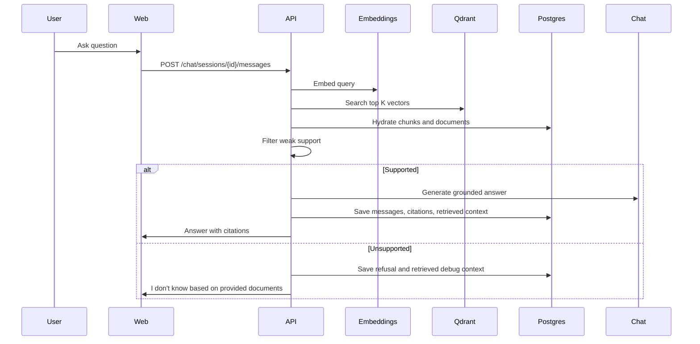

# RAG Pipeline

The RAG path starts after a document reaches `embedded`.

## Grounding Rules

The system prompt requires the model to:

- use only retrieved context
- cite factual claims with numbered labels
- refuse unsupported questions
- avoid sources not present in context

Citation objects are built by the backend from retrieved chunks. The model does not invent source metadata.

## Retrieval Debugging

`POST /retrieval/debug` exposes raw semantic retrieval with:

- chunk ID
- document ID
- filename
- chunk index
- page number
- score
- text

This makes retrieval quality inspectable before answer generation.
